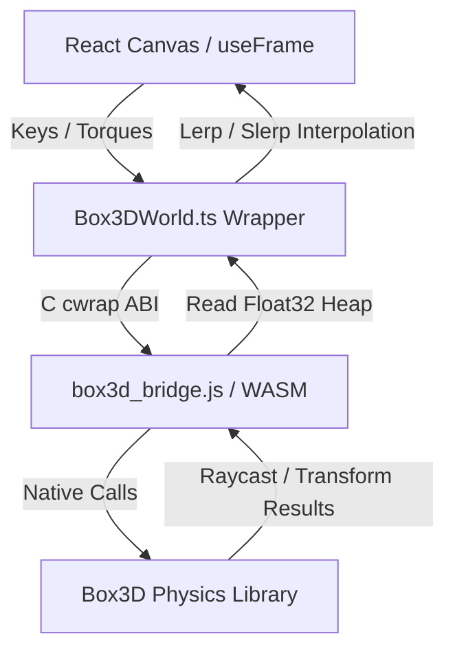

# 🤝 Handoff Documentation: Box3D Physics Beta

Welcome! This document outlines the architecture, data flows, compile workflow, and design decisions of the **Box3D WebAssembly Physics Beta** in the Marble Game.

> **Read `docs/STATUS.md` first** — it holds the live phase/priority stack, verification gates, and session log. This file is the durable architecture reference; STATUS is the moving state.
>
> **Session 25 (2026-07-11) — playtest polish batch 3: orbitable live camera + reflection tuning (1 probe + Fresnel) + fading trails (pure TS/render, no WASM):** three tweaks off s24 playtest. **(1) Live camera is now orbit-able.** The free-orbit-follow camera (was replay-only) now drives LIVE play too: `useFreeFollow = !isReplay || replayCamera==='free'`, and the drei `OrbitControls` mounts whenever that's true. The player drags to orbit / scrolls to zoom while the control target eases onto the ball every frame — focus + position stay locked on the ball, the player just picks the angle. Replay `chase`/`orbit` modes unchanged. **(2) Back to ONE reflection probe + more reflective + Fresnel.** Removed the enemy `CubeCamera`/RT + its per-frame capture (enemy reverts to the scene env-map, metalness .6/rough .3). Player ball is now a **`MeshPhysicalMaterial`** — metalness .85, roughness .10, `envMapIntensity` 1.35 (more mirror than s23's .65/.18/1.0), plus **`clearcoat: 1` / `clearcoatRoughness: .12`** for the Fresnel edge sheen Grayson described (coating reflectance rises toward grazing angles → rim reads more reflective, center calmer). Reflection res stays 256, particles still excluded via `REFLECTION_EXCLUDE_LAYER`. **(3) Path trails fade.** `Box3DPathTrails` rewritten from solid persistent `Line`s to **additive vertex-colored** lines that hold full brightness `FULL_LIFE=6s` then fade over `FADE_LIFE=8s` (fully culled at 14s, front-culled + buffer-compacted). The fade clock advances by `dt·timeScale` (frozen on pause, slowed in slow-mo). Verified `tsc` clean, vitest **123/123**, build **2.521MB**. Same host-tree reconstruction; s21–s25 on host, **one push covers all five**.
>
> **Session 24 (2026-07-11) — playtest polish batch 2: reflections refined + enemy reflections + half-size/sunk obstacles + particles on sim-time + persistent path trails (pure TS/render/sim-placement, no WASM):** direct playtest feedback off s23. **(1) Particles out of the reflection (flicker fix) + verify physics objects reflect.** The additive particle Points were flickering in the ball reflection. New `REFLECTION_EXCLUDE_LAYER = 2` (exported from `Box3DParticles`): both particle `Points` systems `.layers.set(2)`, the MAIN camera `.layers.enable(2)` (still visible normally), and the reflection `CubeCamera`s stay on default layer 0 → they skip the particles but still capture cubes/crumble/debris/props/columns/the other ball/terrain/sky (those were already captured — the flicker just made it read wrong). **(2) More accurate + enemy reflections.** Reflection res 128→**256**; added a **second CubeCamera on the enemy ball** (`enemyReflectRT`/`enemyReflectCam`, enemy hidden during its own capture, `envMap` on the enemy material, metalness .7/rough .22). Two 256 cube probes/frame — the FPS lever if it dips is res or dropping the enemy probe. **(3) Half-size + sunk obstacles.** `DEFAULT_SETTINGS` cube 7→**3.5**, column 3→**1.5** / 12→**6**; `CRUMBLE.scale` 4→**2**; all three static obstacle types now placed at `terrainHeight + half − OBSTACLES.sink` (**sink = 0.5m**) so bases are buried, collider+visual sharing one lowered Y. Size change ships via a **`SCHEMA_VERSION` 7→8 migration** deleting saved `cubeScale`/`columnSize`/`columnHeight` (same {…DEFAULT,…saved} gotcha as v7). 3 placement-test assertions updated to expect the sink; smash/determinism suite unaffected. **(4) Particles obey sim time.** `Box3DScene` computes an effective `timeScaleRef` (0 paused · <1 slow-mo · 1 live) each frame and passes it to `Box3DParticles`, which scales its `dt` — so trails/bursts freeze on pause and dilate during the replay slow-mo instead of running at real time. **(5) Persistent path trails.** New `Box3DPathTrails.tsx`: two growing ground-hugging `THREE.Line`s (teal player / red enemy) that trace each ball's whole-round path (contact-point Y, appended every 0.35u, capped 4000 pts, `DynamicDrawUsage`), cleared on new round, drawn during live play AND replay. Separate from the short-lived ember breadcrumb (both coexist). Verified `tsc` clean, vitest **123/123 ×2**, build **2.520MB**. Same host-tree reconstruction; s21–s24 all on host, **one push covers all four**.
>
> **Session 23 (2026-07-11) — playtest polish batch: reflective ball + unified ground grid + replay scrub/slow-mo/timer + spacebar guard (pure TS/render, no WASM):** four independent asks off a `/pickup`. **(1) Live ball reflections.** The player marble now carries a real-time `THREE.CubeCamera` (128px `WebGLCubeRenderTarget`, mips for roughness blur) that re-samples the whole scene from the ball's position every frame — so it mirrors the *actual* arena (cubes, enemy, terrain, sky), not just the static `<Environment>` preset. The ball is hidden during its own capture (no self-reflection). Material bumped to `metalness 0.65 / roughness 0.18` + `envMap={reflectRT.texture}`. Cost = one extra 6-face pass/frame; enemy stays on the cheap scene env-map. To dial subtler: lower metalness / raise roughness. **(2) Ground grid unified with the cubes.** The floor used a flatter single-weight 512px generator (`useGridTexture`) — "little grids, no big lines, some vanish at distance" (no anisotropy → distance aliasing). Deleted that fn; the terrain now shares `useCubeGridTexture` (2048px, faint minor + strong major lines, `anisotropy 16`) with the cubes, using the existing ground colors. **(3) Replay scrub + slow-mo + timer HUD.** The read-only progress bar is now a **draggable scrub** (`<input type=range>` → pauses + previews locally on drag, commits `seekTo(frame)` on release). Seeking actually works now: `Box3DScene.boot()` **fast-forwards** the fresh sim from frame 0 to the target by replaying recorded inputs (WASM can't rewind), with a new `fastForwardRef` muting sim events (sounds/FX/tag→gameover) during the silent catch-up. New **auto slow-mo ramp** (`replayStore.slowmo`, default on, ReplayBar 🐢 toggle): playback eases toward 0.12× over the final ~90 frames (~1.5s) into the tag. New **HUD**: `⏱ {t}s alive`, a `⏳ TAG IN {t}s` countdown that lights in the ramp window, and `🔴 TAGGED` at the end. **(4) Spacebar never toggles the menu.** Native buttons fire their click on Space, so after clicking a menu/DEV-TOOLS button the next Space collapsed the menu instead of jumping. `Box3DScene`'s window `keydown` now, on Space with a non-text element focused, `preventDefault()`s the button activation + blurs it — jump is still registered regardless, so controls always win; text inputs are untouched. Verified `tsc` clean, vitest **123/123 ×3**, build **2.518MB**. Built by reconstructing the host tree (`5a70002` + uncommitted s21/s22) in a cloud clone; s21+s22+s23 written to host — **one push covers all three** (STATUS Git state).
>
> **Session 22 (2026-07-11) — clutter defaults actually apply + Dev Tools relocate + varied brick debris + Feature D spec (pure TS/render/docs, no WASM):** Grayson ran s21 live but *still saw few crumble blocks*. **Root cause (important, don't re-diagnose):** `persistence.ts` `migrate()` returns `{...DEFAULT_SETTINGS, ...saved}` — **`saved` wins** — so a previously-persisted `crumbleCount:4` (or `propCount:12`) overrides any bump to the defaults. Bumping a default only helps brand-new installs. **Fix:** `SCHEMA_VERSION` 6→7 with a `version < 7` migration that `delete`s `saved.crumbleCount` + `saved.propCount`, so existing saves fall through to the (raised) `DEFAULT_SETTINGS` — crumble **12**, props **12→24**. Grayson can re-lower via the sliders; those persist forward from v7. **Same pattern for any future default bump on a persisted key.** Also: **(2) Dev Tools menu** — `UnifiedDebugMenu` now defaults **closed** (`useState(false)`) and `index.css .debug-menu-wrapper` moved to **bottom-left** with `flex-direction: column-reverse` so the toggle sits in the corner and the panel opens **upward**, bounded by the content's `max-height`+scroll (avoids the old off-screen-growth bug). A new **Clutter** section in the panel has wide-range live sliders (Loose Props 0–80, Crumble Blocks 0–40, 0=off, via `setSetting` → live arena rebuild); the player-facing SettingsMenu "Loose Props" ceiling went 40→80 to match. **(3) Varied brick debris** — `MarbleSim` debris shard dims (`shardX/Y/Z`) now draw from wide, independent ranges (X,Z 0.7–2.4·base; Y 0.5–1.8·base) so rubble reads as mixed cubic/slab/long bricks instead of uniform flat cuboids; still exactly 3 seeded `rand()` draws per shard, so F9 determinism is untouched. **(4) Feature D speced** into `docs/PLAN.md` (destructible columns → brick debris: reuse the crumble smash/burst/pool machinery on the column bodies, height-distributed brick burst, lavender debris; ~1 session, no new WASM). Verified `tsc` clean, vitest **123/123 ×3**, build 2.516MB. Built in a fresh cloud clone of `5a70002`; s21+s22 written to host, **one local push covers both** (STATUS Git state).
>
> **Session 21 (2026-07-11) — crumble buff + free-orbit replay camera (Grayson playtest response, pure TS/render, no WASM):** Grayson loved the s20 crumble smash and asked for "lots more of them," double/triple the debris, and a replay camera he can orbit himself. Delivered three tuning/feature changes: **(1)** `DEFAULT_CRUMBLE_COUNT` 4→12 (`tuning.ts`) + the `SettingsMenu` "Crumble Blocks" slider ceiling 20→40. **(2)** `CRUMBLE.debrisPerBlock` 9→24 and `CRUMBLE.maxLiveDebris` 60→240 (`tuning.ts`) — the cap is raised in lockstep so ~10 blocks can burst near-simultaneously (10×24) before the retire-oldest perf guard eats shards; the render debris `instancedMesh` and sim debris pool both size off `maxLiveDebris`, so they scale automatically. The `Box3DWorldIntegration` smash tests assert `debrisActiveCount === CRUMBLE.debrisPerBlock` **symbolically**, so they track the new value — 123/123 unaffected. **(3)** New replay camera mode **`'free'`, now the default** (`replayStore.ts`: `ReplayCamera = 'free' | 'chase' | 'orbit'`, `camera: 'free'`). It's a **drei `OrbitControls`** instance mounted in `Box3DPlayableScene`'s JSX **only when `isReplay && replayCamera === 'free'`** (conditional mount = it never coexists with, or fights, the manual chase/cinematic cameras). `enablePan={false}` + `makeDefault` + `enableDamping` (0.12) + zoom clamp 4–80u + `maxPolarAngle ≈ 0.495π` (can't dip under the floor). The follow is done in `useFrame`: a three-way camera branch where the `'free'` case seeds a behind/above framing on the first frame (a `freeCamReady` latch), then each frame **eases `controls.target` onto the player render pos** and calls `controls.update()` — OrbitControls re-derives the camera position from target+spherical, so the **user's chosen angle/zoom is preserved while the ball never leaves frame.** `ReplayBar` gains a **Free** button (first, active by default); `Chase` + cinematic `Orbit` remain. Verified `tsc` clean, vitest **123/123 ×3**, build clean (2.515MB). Built in a fresh cloud clone of `origin/v2@5a70002`, written to host, **not yet pushed** (one local `git push` — see STATUS Git state). No WASM/native/collider changes.
>
> **Session 20 (2026-07-11) — Phase P Feature C: voxel-crumble / crashable scenery (fake path, no WASM):** crumble blocks are crashable **static boxes** that burst into **dynamic-sphere debris**, reusing Feature A's prop machinery. New `CRUMBLE` block in `tuning.ts` + `crumbleCount` store key (`ObstacleConfig`, optional, default 4; drawn **last** from the seeded scatter stream so `crumbleCount:0` callers/tests stay byte-identical). In `MarbleSim`: tracked static-box blocks (`crumbleBodyPtrs`/`crumblePositions`/`crumbleQuaternions`/`crumbleAlive`, authoritative `crumbleScale`); `step()` calls `detectSmashes` (player OR un-frozen enemy in sphere-vs-AABB contact + full-speed > `CRUMBLE.smashSpeed`) → `smashBlock` **parks the static body at `CRUMBLE.parkY`** (cheaper + reversible vs destroy) and creates a seeded burst of `debrisPerBlock` dynamic spheres (outward+up impulse, spin, elongated shard visual dims). Debris is a lazily-grown pool capped at `maxLiveDebris` (retire-oldest), culled on fall-off, and **cleared + blocks reformed in `resetPositions`**. New `Box3DWorld.destroyBody(ptr)` retires a single body (removes it from the tracked list first → no double-free at teardown; native destroy is the Known #7 fix). Render (`Box3DScene`): a crumble `instancedMesh` (unit box, per-frame matrix, zero-scaled when smashed) + a fixed `maxLiveDebris`-size debris `instancedMesh` (live slots interpolated from `debrisPrev/Curr`, rest zero-scaled), both `frustumCulled={false}`. **F9-safe by construction** (trigger from sim state, all debris values from the seeded RNG stream, `crumbleCount` in the replay header) and **occlusion-decoupled** (separate mesh; the cube/column occlusion arrays are untouched — crumble blocks are intentionally NOT occluded in v1). "Real" dynamic-box-voxel path (WASM, stacking/toppling bricks) stays backlogged — only worth it if the fake's resting shard look disappoints in playtest. Also this session: `.gitattributes` added (LF normalize, kills the CRLF phantom) + `npm audit` → 0 vulns (dev-tooling bumps only).
>
> **Session 20b (2026-07-11) — in-cloud WASM rebuild + "real" dynamic-box crumble.** Two architectural firsts: (1) **The Box3D WASM bridge now rebuilds entirely in a cloud container** (emscripten + `erincatto/box3d@aaa795e`), behavior-equivalent to Grayson's host build — proven by rebuilding the *unchanged* bridge and passing the full integration suite (F1 = 1.767s identical). This retires the long-standing "collider changes need a Windows-host `emcc` rebuild" constraint. Recipe + script: `native/build-box3d-bridge.sh` + memory [[game-marble-wasm-cloud-build]]. (2) **The bridge gained a 4th collider op: `marble_box3d_create_dynamic_box`** (dynamic body + box hull + `b3Body_ApplyMassFromShapes`), threaded through `box3dBridge.ts` → `Box3DWorld.createDynamicBox`. Feature C debris switched from dynamic spheres to these dynamic boxes with half-extents = shard/2, so the **collider now matches the shard visual exactly** — retiring the debris "visual≠collider" compromise (columns-as-cylinders and tilted-obstacle colliders remain visual-only until their primitives are added the same way). The shipped `public/box3d/box3d_bridge.wasm` is now a cloud rebuild (441748 B). The collider-primitive budget in `docs/PLAN.md` Phase P (§ "The primitive budget") should now read **box+sphere+heightfield+dynamic-box**. Verified `tsc` clean, vitest **123/123 ×3**, build clean (2.499MB).
>
> **⚠️ Local-clone gotcha (flagged 2026-07-10):** The Windows working clone (`C:\Projects-local\Game-Marble`) shows ~50 files as "modified" in `git status` with no real edits — that's **CRLF line-ending drift**, not content changes, and it buries real diffs. A stale `.git/index.lock` (crashed or parallel git process) was also present. Before trusting any diff: **(1)** if git reports `index.lock exists`, close GitHub Desktop / editors and delete `.git/index.lock`; **(2)** normalize instead of committing the noise — add a `.gitattributes` (`* text=auto eol=lf`, and `*.bat` / `*.ps1` `text eol=crlf`) then `git add --renormalize .` as one commit. Also: the remote `.gitignore` gained a bare-`.env` ignore this session (commit `b7424c3`) — `git pull` to get it. **Do not mass-commit the CRLF diff** — it's phantom.
>
> **Session 16 (2026-07-10) — column camera occlusion (built in a fresh cloud clone of `origin/v2@25c0032`):** the s15 "reuse the see-through modes for columns" thread. `systems/render/occlusion.ts` generalized from uniform-cube to **non-uniform box** — new `segmentIntersectsBox(...,hx,hy,hz)` and `findOccludingBoxes(...,hx,hy,hz,...)`; the old `segmentIntersectsCube`/`findOccludingCubes` now delegate to them, so the cube path + its tests are byte-identical. New shared **`components/game-beta/ObstacleOcclusion.tsx`** holds the whole hide/restore + per-mode reveal loop for both shapes (`shape: {kind:'box',size} | {kind:'cylinder',radius,height}` → AABB half-extents + reveal geometry; tilt quaternions applied like before). **`CubeOcclusion.tsx` is now a thin wrapper** over it (cube call site + exported `OcclusionMode` type unchanged). `Box3DScene` mounts a second `<ObstacleOcclusion>` for columns (`columnsRef`, cylinder shape from `sim.columnSize`/`sim.columnHeight`, lavender `#b8b0c8` tint, same `occlusionMode`). Detection uses the **square-footprint box** = collider-accurate (the column collider is also a square box); the reveal draws the cylinder to match the visual. Same 5 modes (ghost/wireframe/xray/silhouette/off) now apply to both cubes and columns; no new UI. Verified `tsc` clean, vitest **81/81 ×5** (77 prior + 4 new box/column occlusion tests), build clean (2.476MB).
>
> **Session 15 (2026-07-09) — control panel + polish (built in a fresh cloud clone of `origin/v2@dc083ee`):** (1) **Right-hand SettingsMenu rewired (Known #6 closed).** It was wired almost entirely to legacy Cannon store keys the Box3D sim never reads (so the whole panel "felt dead"); now every control maps to a real Box3D knob — velocity movement (`moveTopSpeed`/`moveAccel`/`moveBrakeDecel`/`moveAirControl`/`jumpHeight`/`playerDrift`/`downhillRoll`), enemy drive (`enemySpeed`/`enemyVelUnit`/`enemyVelAccel`/`enemyAirControl`/`enemySize`/`enemyMass`), **Physics-Feel** gravity preset, **Play-Feel** preset, Environment (cubes+columns), **camera** (`cameraStiffness`/`cameraOffset`, now live — were hardcoded 6/11), **ground look** (now live — was a hardcoded texture), **occlusion mode**, and **Shadows**. Dead legacy sliders removed. (2) **Camera + ground defaults re-anchored + a v3→v4 settings migration** resets stale Cannon-era persisted values so wiring them live is look/feel-neutral. (3) **Environment + enemy size/weight rebuild live** (`Box3DScene` boot dep array now includes the arena keys; a stable per-session `seedRef` keeps the scatter layout coherent across rebuilds) — fixes "I restart and it doesn't change" (restart never remounted the scene). (4) **Obstacles orient to the terrain normal** (`utils/terrain.ts` `getTerrainNormal` → `MarbleSim.cubeQuaternions`/`columnQuaternions`, composed into instance matrices) — visual tilt only, colliders stay AA. (5) **See-through modes** (`occlusionMode`: ghost/wireframe/xray/silhouette/off — `CubeOcclusion.tsx`). (6) **Leaderboard top-100** (cap 10→100) + game-over **zoom-to-your-rank** window (`computePlacingWindow`). (7) **Columns render as real cylinders** (`<cylinderGeometry>`, radius `columnSize/2`) instead of squished cube boxes — visual only; the collider stays a square box (no cylinder bridge primitive → backlog #6). Verified `tsc` clean, vitest 77/77 ×5, build clean (2.475MB). See the new sections below.
>
> **Current feel state (2026-07-09, session 9):** player + enemy both **velocity-driven**. Feel: coast **drift/inertia**, **downhill roll** (analytic terrain gradient), **height-based jump** (default 1.8u), baseline **blend (C)** — all live sliders. Session 8 added three render/UX systems: **see-through cubes** (camera occlusion), a **particle FX structure** (roll trails + impact/landing bursts), and **play-feel presets** (5 one-click flavours). Session 9 added: **pause/gameover render-freeze** (`Canvas frameloop='demand'` when frozen — GPU stops redrawing), **countdown early-release** (`SimParams.freezeEnemy` pins the enemy at spawn so the first control-key press gives the player a head start), and **particle polish** — a red **enemy roll trail** + a fading ember **ground breadcrumb** on its own pooled system (sim now exposes `enemyVel`/`enemyGrounded`). Legacy torque/force paths remain behind DEV toggles. **Sessions 8+9 committed as `d74fc94`; Grayson gave a light "I think it worked" — detailed per-feature verdicts still welcome.** See "Render & FX systems" below for the particle architecture.
>
> **Session 10 (2026-07-09):** shipped the **Known #7** native-body-leak fix — `marble_box3d_body_destroy` now calls `b3DestroyBody(body->bodyId)` before freeing its JS wrapper (previously it freed *only* the wrapper, so the smoke-test dynamic sphere from `Box3DWorld.reset()` lingered in the native world at origin ≈ y4.35). WASM rebuilt on host + playtest-confirmed. C-only change; JS/TS destroy paths audited for double-free (none).
>
> **Session 14 (2026-07-09):** **Obst-2 columns (tall static pillars).** The sim already scattered, collided, and seed-tested columns (`MarbleSim.columnPositions`); this session wired the last mile so they actually appear and are tunable. New store keys `columnCount/columnSize/columnHeight` (`state/types.ts` + `DEFAULT_SETTINGS` 6/3/12 in `persistence.ts`); `Box3DScene.boot()` passes them into the sim's `obstacles` config (was hardcoded `0`); `MarbleSim` now exposes readonly **authoritative** `columnSize`/`columnHeight` (render must read these, not the live store — same anti-drift rule as `cubeScale`). A second `<instancedMesh>` in `Box3DPlayableScene` renders the pillars (`boxGeometry [size, height, size]`, lavender `#b8b0c8` over the shared cube grid texture, matrices set once per sim like the cubes). Player-facing sliders live in **SettingsMenu → 🌳 Environment** (Column Count/Size/Height) — apply on restart, same as the cube sliders (Known #5). **Columns were not yet camera-occluded** (`findOccludingCubes` took a single uniform `half`, wrong for a tall pillar) — **now resolved in session 16** via the non-uniform `findOccludingBoxes` + shared `ObstacleOcclusion`. Verified: `tsc` clean, vitest 71/71 ×5, build clean (2.47MB).
>
> **Session 13 (2026-07-09):** **game-over "your placing" row.** The end screen's top-5 leaderboard (`components/ui/MenuOverlay.tsx` `GameOverScreen`) now appends a `⋯` divider + a gold-highlighted `#N (You)` row when the current run ranks 6th or lower, so the player can see where they placed vs the leaders without being in the top 5. A run below the tracked top 10 shows `#11+` with the live score (records cap at 10, so exact place beyond that isn't stored). The placing decision is a **pure, React-free helper** — `components/ui/records.ts` `computeYourPlacing(records, score, visibleCount, todayLabel)` — unit-tested in `records.test.ts` (5 cases); `MenuOverlay` just renders what it returns, reusing the existing current-run highlight style. If deeper true ranks are ever wanted, raise the `personalRecords` cap in `saveRecord` (`state/settingsSlice.ts`, currently `.slice(0, 10)`).
>
> **Session 12 (2026-07-09):** **retired the legacy movement models** — the player torque path (`applyTorqueControl`) and the enemy force-steering path are gone, along with the `movementModel`/`enemyMovementModel` store keys + DEV dropdowns + `MovementModel`/`EnemyMovementModel` types and the now-dead tuning constants. Velocity is the sole model. Zero feel change (velocity path untouched); build ~3KB lighter. The physics presets were trimmed to the three that carry real gravity variety (`current`/`v1Gravity`/`blend`, used by the Play-Feel presets); the dead `frictionOnly` A/B preset was removed (no-op duplicate of `current` under velocity — friction is bypassed grounded). DEV "Physics Feel" dropdown relabeled Light/Heavy/Blend.
>
> **Session 11 (2026-07-09):** the velocity-drive feel knobs are now **live-tunable from the settings store** (Known #6 core). Player `moveTopSpeed` / `moveAccel` / `moveBrakeDecel` / `moveAirControl` and enemy `enemyVelUnit` / `enemyVelAccel` are new store keys threaded through `SimParams` into `applyVelocityControl` / `applyEnemyVelocityControl`, exposed as a DEV TOOLS "Movement Tuning" slider group (+ an `enemySpeed` slider). Additive and safe: defaults are sourced from `tuning.ts` (`MOVEMENT.*` / `ENEMY.*`) so they can't drift, and the sim reads `params.X ?? CONST` so any caller omitting them (all prior tests) behaves byte-identically. Verified `tsc` clean, vitest 65/65 ×5, build clean.

---

## 🏗️ Architecture Overview

The Box3D beta runs alongside the standard Cannon physics system. It is selectable by adding the query parameter `?physics=box3d` to the address bar.



### 1. The C Bridge (`box3d_bridge.c`)
* **Opaque Pointer Pattern:** Box3D rigid bodies (`b3BodyId`) are wrapped in allocated structs (`MarbleBox3DBody`) on the C heap. JavaScript references them via opaque 32-bit pointers (`uintptr_t`).
* **Memory Management:** To avoid memory leaks, `b3HeightFieldData` allocations are tracked in a registry within the custom `MarbleBox3DBridgeWorld` struct. This guarantees that all native heightfield structures are automatically freed on world destruction.
* **Body lifecycle (session 10):** `marble_box3d_body_destroy` destroys the native Box3D body via `b3DestroyBody(body->bodyId)` (guarded by `b3Body_IsValid`) *before* freeing the JS wrapper struct. Prior to session 10 it freed only the wrapper, leaking the native body into the world — the cause of the origin smoke-sphere persisting (Known #7). Callers (`Box3DWorld.clearBodies` / `destroyWorldOnly`) destroy each pointer once then clear their list, so there is no double-free with world/heightfield teardown.
* **Heap Copy Optimization:** Transforms, velocities, and raycast hit results are copied directly into pre-allocated memory slices in the WebAssembly heap buffer, avoiding serialization overhead.

### 2. TypeScript Adapter (`Box3DWorld.ts` & `box3dBridge.ts`)
* Manages WebAssembly heap allocation pointers (e.g. `transformPtr`, `velocityPtr`, `raycastPtr`).
* Implements type-safe wrappers for force/torque impulses, damping settings, resets, and raycasting queries.

### 3. Visual & Simulation Loop (Box3DScene.tsx)
* **WASM-Native Vision & Ground Queries:** Replaces Three.js raycasts with native `world.raycastClosest` queries.
  * *Vision:* Ray length matches displacement vector to player. Uses a dynamic fraction threshold check to verify clear line-of-sight without clipping player boundaries.
  * *Grounding:* Downward raycast fraction <= `(size+0.2) / (size+0.4)` evaluates if entity is grounded.
* **Pausing:** Toggles the loop execution using the store's `isPaused` state to completely freeze the physics simulation and visual interpolation hooks.
* **Unified Rules & Sonar Loop Ticking:** Houses a custom `Box3DGameLoopDriver` child component which advances the `GameLoop` and ticks the neutral `rulesSystem` and `sonarSystem` every frame.
* **Spatial Audio Listener:** Drives `soundManager.updateListener` and manages the audio graphs during setup, play, pause, and game-over transitions.
* **Interpolation:** Visual meshes are smoothed using `lerp` and `slerp` against physics transforms to prevent high-frequency frame jitter.

> Note: since the session-3 headless refactor, gameplay logic (input, AI, tag, resets) lives in **`systems/sim/MarbleSim.ts`**, not inline in `Box3DScene.tsx`. The scene is render + glue only. Treat `MarbleSim` as the authority for anything below.

### 4. Movement Model (`systems/sim/MarbleSim.ts` + `tuning.ts`)
**Velocity-driven is the sole model** (the legacy torque/force alternatives were retired session 12 after velocity won the Known-#4 A/B). `applyVelocityControl` drives the player's *horizontal velocity* directly toward `inputDir · MOVEMENT.topSpeed` (accelerate at `MOVEMENT.accel`, brake at `MOVEMENT.brakeDecel`), and slaves spin to motion — rolling-without-slip about the up normal gives `ω = (v_z/r, 0, -v_x/r)`. Vertical velocity (gravity/jump) is left to physics; airborne hands back to physics apart from a light `airControl` nudge. Result: 1:1 ball-on-ground feel, no wheel-spin.

Feel is tuned via the `MOVEMENT` block in `tuning.ts` — and, as of session 11, the core knobs (`topSpeed`/`accel`/`brakeDecel`/`airControl`) are **live-overridable per step** via `SimParams.moveTopSpeed`/`moveAccel`/`moveBrakeDecel`/`moveAirControl` (store keys, DEV "Movement Tuning" sliders). The sim reads `params.X ?? MOVEMENT.X`, so the `tuning.ts` values remain the defaults. Coast internals (`coastDrag*`, `coastFloor`, `downhillMaxSpeed`) stay constants. Input mapping: forward = `-Z`, right = `+X`. The velocity model overrides grounded traction directly, so `PLAYER.friction` and the physics-preset **friction** lever are now largely vestigial (they only affect collisions/airborne contact); **gravity** and **jump height** are the levers that still matter.

**Velocity-model feel (all live via `SimParams`, no rebuild):**
* **Enemy velocity drive** — `applyEnemyVelocityControl` mirrors the player: velocity toward the AI heading (with avoidance) at `enemySpeed · getSpeedMultiplier(state) · ENEMY.velUnit`, spin slaved `ω = v/r`. (The enemy is pinned at spawn instead when `SimParams.freezeEnemy` is set — countdown early-release.) Chase ≈ 19.5 u/s at default `enemySpeed 2` — tune live with the `enemyVelUnit` / `enemyVelAccel` / `enemySpeed` sliders (session 11; `params.enemyVelUnit ?? ENEMY.velUnit`, etc.).
* **Coast drift / inertia** — on release (grounded, no input) velocity decays by exponential drag (`MOVEMENT.coastDragMax→Min`, picked by the `playerDrift` 0..1 slider) plus a small `coastFloor` so it settles on flat. Long, floaty glide at high drift.
* **Downhill roll** — while coasting on a slope, accelerate downhill by `|g|·sinθ · downhillRoll`. **θ comes from the analytic `getTerrainHeight` gradient, NOT the raycast normal** (the WASM heightfield raycast returns a flat up-normal — verified). Consequence: rolls on terrain, not on cube tops. `downhillRoll` 0..1 slider.
* **Height-based jump** — vertical velocity set directly to `sqrt(2·|g|·jumpHeight)` (mass-free, exact, height constant across gravity presets). `jumpHeight` slider, default `PLAYER.jumpHeight = 1.8`. `PLAYER.jumpImpulse`/preset `jumpImpulse` are now vestigial (kept only for the PhysicsFeel preset contract + its parity test).

---

## 🎨 Render & FX systems (session 8)

These are **render-layer** systems — they read sim state / listen to cosmetic sim events but never feed back into `MarbleSim`, so determinism (F8/F9) is untouched.

### See-through cubes (camera occlusion)
`systems/render/occlusion.ts` is pure geometry: `segmentIntersectsCube` (slab method, clamped to the segment's [0,1]) and `findOccludingCubes(cam, player, centers, half)` → cube indices the camera→player sightline passes through, nearest-first, capped, with the segment shortened near the player so a cube it rests against doesn't strobe. No raycaster, no BVH — it runs against the sim's authoritative `cubePositions`, so it's unit-tested headlessly. `components/game-beta/CubeOcclusion.tsx` calls it ~20 Hz: hides blocking InstancedMesh instances (zero-scale matrix), restores others (composing the cube's terrain-tilt quaternion so the restore matches the tilted solid instance), and renders a **reveal** in their place. It's fed the interpolated player render position via `playerRenderPosRef` from `Box3DPlayableScene`.

**Reveal modes (session 15 — `occlusionMode` store key, Settings → Visuals):** `ghost` (original ~40% transparent textured + faint edges), `wireframe` (edges-only bounding box, fully see-through), `xray` (back-faces only — the near face is culled so you see through into the far interior wall, reading the cube's depth + where you're colliding), `silhouette` (dark tinted see-through fill + bright edges), `off` (no occlusion). The mode also drives whether the solid instance is hidden; a mode-change effect restores every hidden instance so nothing is left invisible. Ghost meshes inherit each cube's tilt quaternion. Occlusion is still **cubes only** — columns stay solid (the session-14 column-occlusion backlog item can now reuse these modes once a non-uniform-AABB `findOccludingCubes` variant exists).

### Particle FX (extensible structure)
`systems/fx/ParticleSystem.ts` is a **pooled, single-draw-call** system (render-side, framework-agnostic): SoA `Float32Array`s, swap-remove on death, one additive `THREE.Points`. Particles fade by scaling colour → 0. Per-particle gravity (trails float, impacts fall). API: `emit()` (one), `emitBurst()` (radial), `emitTrail()` (one behind the ball), `update(dt)`, `clear()`. **To add a new effect, add an `emit*` call — no new draw call.**

`components/game-beta/Box3DParticles.tsx` owns one system and drives three emitters:
- **roll trails** — each frame while `sim.playerGrounded` and horizontal speed > `FX.trailMinSpeed`, at a rate that scales with speed;
- **impact bursts** — on the sim's `onImpact` event;
- **landing bursts** — on the sim's `onLand` event.

The sim→particles channel is a `WeakMap<MarbleSim, handler>` (`dispatchFx`), set on mount and called by the sim-event callbacks wired in `Box3DScene.boot()` — same pattern as the AI-state listener.

**Sim cosmetic events** (`SimEvents`, all optional, render-only): `onImpact(x,y,z,strength)` fires when horizontal speed drops > `FX.impactSpeedDrop` in one step (wall/cube hit — the velocity model can't drop that fast on its own, so it's unambiguous); `onLand(x,y,z,impactSpeed)` fires on an airborne→grounded transition when the prior downward speed exceeded `FX.landSpeed`. Fall-resets zero the trackers to avoid false positives. Thresholds live in `tuning.ts` `FX`.

### Play-feel presets
`tuning.ts` `PLAYFEEL_PRESETS` (Classic / Ice Rink / Arcade / Heavyweight / Predator) bundle `physicsPreset + playerDrift + downhillRoll + jumpHeight + enemySpeed`. `applyPlayfeelPreset(name)` writes those store values and sets `playfeelPreset`; nudging any of `PLAYFEEL_KEYS` afterward flips it to `custom` (same pattern as `graphicsPreset`). `classic` mirrors `DEFAULT_SETTINGS` (guarded by a test). DEV TOOLS "Play-Feel" dropdown. Note: a preset can change `physicsPreset`, which rebuilds the arena (resets the round).

---

## 🛠️ Build & Compilation Workflow

### Requirements
* **Emscripten (emcc):** Installable via Scoop or EMSDK.
* **PowerShell:** Script execution permissions.

### Build Command
To compile the C source files into WebAssembly, run:
```powershell
powershell -ExecutionPolicy Bypass -File .\src\physics\box3d\native\build-box3d-bridge.ps1
```
This builds and places `box3d_bridge.js` and `box3d_bridge.wasm` in the `public/box3d` directory.

---

## 📐 Math & Grid Alignment Details
* **Terrain Winding:** Box3D heightfields are row-major (`z * countX + x`). This matches Three's visual terrain arrays.
* **Centering Offset:** Because Box3D grids start at `(0,0)`, the body transform must be offset by `[-((WIDTH - 1) * SCALE) / 2, 0, -((DEPTH - 1) * SCALE) / 2]` (which translates to `[-63, 0, -63]`) to align the visual mesh and physical collision boundaries exactly.

---

## 🔮 Future Backlog / Wish List

1. **Gameplay Recorder & Replay:** (Added to `BOX3D_BETA_PLAN.md`) Track entities, export states, and replay with free camera angles.
2. **Modular Enemy Strategies:** Support flanking, ambushing, or patrol patterns.
3. ✅ **See-through cubes / camera occlusion — DONE (session 8).** See "Render & FX systems" above (`systems/render/occlusion.ts` + `CubeOcclusion.tsx`). The old Cannon-path `components/game/CameraOcclusion.tsx` is now superseded for Box3D.
4. **FX polish (session-8 backlog):** per-particle **size** (needs a small `ShaderMaterial` — `PointsMaterial` is one fixed size for all particles); a **trail on the enemy** too; a **jump-launch puff** (fire an `onJump` cosmetic event); tune `FX` thresholds + colours to taste.
5. **Column camera occlusion (session-14 backlog):** columns (Obst-2) are solid — a tall pillar between camera and player blocks the view, unlike cubes which now reveal (sessions 8 + 15). `systems/render/occlusion.ts` assumes a uniform cube `half`; supporting columns needs a non-uniform-AABB variant of `findOccludingCubes` (per-axis half extents) + a column render that reuses the session-15 reveal modes in `CubeOcclusion.tsx` (or a sibling). Only worth building if Grayson's playtest says the pillars are visually obtrusive.
6. **Round + rotated obstacle colliders (session-15 backlog):** obstacles now (a) tilt to the terrain normal and (b) render columns as **cylinders** — both *visual* only. The physics `createStaticBox` colliders stay axis-aligned square boxes (the bridge has neither a rotation arg nor a cylinder primitive). A true tilted/round collider needs new `marble_box3d_create_*` bridge functions (quaternion + a cylinder primitive) + a WASM recompile (same class of change as the Known #7 fix). Gentle slopes + thin columns keep the mismatch minor (a cylinder's square collider overhangs ~0.62u at the 4 diagonals on a default size-3 pillar); only worth building if collisions feel off in playtest.
7. **Debounce the live arena rebuild (session-15 backlog):** Environment/enemy sliders now rebuild the WASM world on every change (live feedback). If dragging stutters, debounce the rebuild (rebuild ~250ms after the last change) instead of per-tick.
8. ✅ **Destructible columns → brick debris (Feature D) — DONE (session 26).** Columns are now smashable (`columnsCrumble`, default on): a fast hitter parks the pillar + bursts it into a height-scaled lavender brick shower, reusing the Feature-C crumble machinery (park/pool/reform/F9). `ObstacleOcclusion` is now `alive?`-aware so a smashed pillar drops out of occlusion. Next escalations off this: real cylinder/rotated colliders (item 6, needs in-cloud WASM) and stacking/toppling brick-columns (blocks built of many small dynamic boxes).
