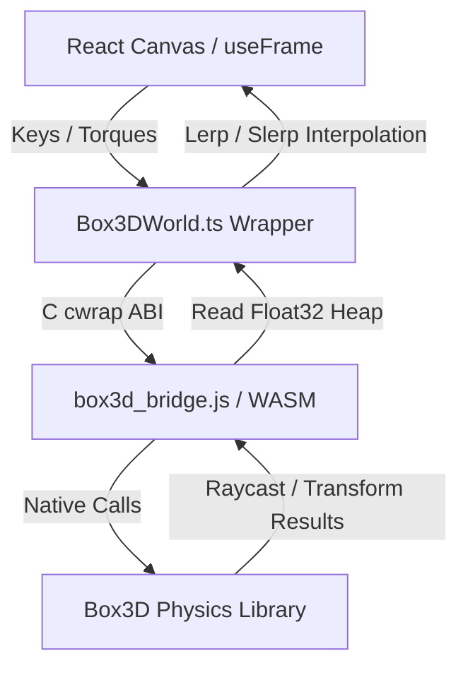

# 🤝 Handoff Documentation: Box3D Physics Beta

Welcome! This document outlines the architecture, data flows, compile workflow, and design decisions of the **Box3D WebAssembly Physics Beta** in the Marble Game.

> **Read `docs/STATUS.md` first** — it holds the live phase/priority stack, verification gates, and session log. This file is the durable architecture reference; STATUS is the moving state.
>
> **Current feel state (2026-07-09, session 8):** player + enemy both **velocity-driven**. Feel: coast **drift/inertia**, **downhill roll** (analytic terrain gradient), **height-based jump** (default 1.8u), baseline **blend (C)** — all live sliders. Session 8 added three render/UX systems: **see-through cubes** (camera occlusion), a **particle FX structure** (roll trails + impact/landing bursts), and **play-feel presets** (5 one-click flavours). Legacy torque/force paths remain behind DEV toggles. **Awaiting Grayson's playtest** of the session-8 features. See "Render & FX systems" below for the particle architecture.

---

## 🏗️ Architecture Overview

The Box3D beta runs alongside the standard Cannon physics system. It is selectable by adding the query parameter `?physics=box3d` to the address bar.



### 1. The C Bridge (`box3d_bridge.c`)
* **Opaque Pointer Pattern:** Box3D rigid bodies (`b3BodyId`) are wrapped in allocated structs (`MarbleBox3DBody`) on the C heap. JavaScript references them via opaque 32-bit pointers (`uintptr_t`).
* **Memory Management:** To avoid memory leaks, `b3HeightFieldData` allocations are tracked in a registry within the custom `MarbleBox3DBridgeWorld` struct. This guarantees that all native heightfield structures are automatically freed on world destruction.
* **Heap Copy Optimization:** Transforms, velocities, and raycast hit results are copied directly into pre-allocated memory slices in the WebAssembly heap buffer, avoiding serialization overhead.

### 2. TypeScript Adapter (`Box3DWorld.ts` & `box3dBridge.ts`)
* Manages WebAssembly heap allocation pointers (e.g. `transformPtr`, `velocityPtr`, `raycastPtr`).
* Implements type-safe wrappers for force/torque impulses, damping settings, resets, and raycasting queries.

### 3. Visual & Simulation Loop (Box3DScene.tsx)
* **WASM-Native Vision & Ground Queries:** Replaces Three.js raycasts with native `world.raycastClosest` queries.
  * *Vision:* Ray length matches displacement vector to player. Uses a dynamic fraction threshold check to verify clear line-of-sight without clipping player boundaries.
  * *Grounding:* Downward raycast fraction <= `(size+0.2) / (size+0.4)` evaluates if entity is grounded.
* **Pausing:** Toggles the loop execution using the store's `isPaused` state to completely freeze the physics simulation and visual interpolation hooks.
* **Unified Rules & Sonar Loop Ticking:** Houses a custom `Box3DGameLoopDriver` child component which advances the `GameLoop` and ticks the neutral `rulesSystem` and `sonarSystem` every frame.
* **Spatial Audio Listener:** Drives `soundManager.updateListener` and manages the audio graphs during setup, play, pause, and game-over transitions.
* **Interpolation:** Visual meshes are smoothed using `lerp` and `slerp` against physics transforms to prevent high-frequency frame jitter.

> Note: since the session-3 headless refactor, gameplay logic (input, AI, tag, resets) lives in **`systems/sim/MarbleSim.ts`**, not inline in `Box3DScene.tsx`. The scene is render + glue only. Treat `MarbleSim` as the authority for anything below.

### 4. Player Movement Model (`systems/sim/MarbleSim.ts` + `tuning.ts`)
Two selectable models, switched live via the `movementModel` store key (read every step from `SimParams`, no rebuild):

* **`velocity` (default, the good one):** `applyVelocityControl` drives the player's *horizontal velocity* directly toward `inputDir · MOVEMENT.topSpeed` (accelerate at `MOVEMENT.accel`, decelerate at `decel`/`brakeDecel`), and slaves spin to motion — rolling-without-slip about the up normal gives `ω = (v_z/r, 0, -v_x/r)`. Vertical velocity (gravity/jump) is left to physics; airborne hands back to physics apart from a light `airControl` nudge. Result: 1:1 ball-on-ground feel, no wheel-spin.
* **`torque` (legacy):** `applyTorqueControl` applies spin and relies on contact friction to convert it — perpetually slips. Kept for A/B only.

Feel is tuned via the `MOVEMENT` block in `tuning.ts`. Input mapping (both models): forward = `-Z`, right = `+X`. Note the velocity model largely bypasses `PLAYER.friction`/`torque`/`directionChangeBoost` and the physics-preset **friction** lever while grounded (those still matter for the torque model + airborne physics; gravity/jump affect both).

**Session-7 velocity-model feel (all live via `SimParams`, no rebuild):**
* **Enemy velocity drive** — `applyEnemyVelocityControl` mirrors the player: velocity toward the AI heading (with avoidance) at `enemySpeed · getSpeedMultiplier(state) · ENEMY.velUnit`, spin slaved `ω = v/r`. Switched by `enemyMovementModel` (`velocity` default, `force` legacy). Chase ≈ 19.5 u/s at default `enemySpeed 2` — tune with `ENEMY.velUnit`/`velAccel` or the `enemySpeed` slider.
* **Coast drift / inertia** — on release (grounded, no input) velocity decays by exponential drag (`MOVEMENT.coastDragMax→Min`, picked by the `playerDrift` 0..1 slider) plus a small `coastFloor` so it settles on flat. Long, floaty glide at high drift.
* **Downhill roll** — while coasting on a slope, accelerate downhill by `|g|·sinθ · downhillRoll`. **θ comes from the analytic `getTerrainHeight` gradient, NOT the raycast normal** (the WASM heightfield raycast returns a flat up-normal — verified). Consequence: rolls on terrain, not on cube tops. `downhillRoll` 0..1 slider.
* **Height-based jump** — vertical velocity set directly to `sqrt(2·|g|·jumpHeight)` (mass-free, exact, height constant across gravity presets). `jumpHeight` slider, default `PLAYER.jumpHeight = 1.8`. `PLAYER.jumpImpulse`/preset `jumpImpulse` are now vestigial (torque path + preset contract only).

---

## 🎨 Render & FX systems (session 8)

These are **render-layer** systems — they read sim state / listen to cosmetic sim events but never feed back into `MarbleSim`, so determinism (F8/F9) is untouched.

### See-through cubes (camera occlusion)
`systems/render/occlusion.ts` is pure geometry: `segmentIntersectsCube` (slab method, clamped to the segment's [0,1]) and `findOccludingCubes(cam, player, centers, half)` → cube indices the camera→player sightline passes through, nearest-first, capped, with the segment shortened near the player so a cube it rests against doesn't strobe. No raycaster, no BVH — it runs against the sim's authoritative `cubePositions`, so it's unit-tested headlessly. `components/game-beta/CubeOcclusion.tsx` calls it ~20 Hz: hides blocking InstancedMesh instances (zero-scale matrix), restores others, and renders a ~40%-transparent textured "ghost" (+ faint wireframe) in their place. It's fed the interpolated player render position via `playerRenderPosRef` from `Box3DPlayableScene`.

### Particle FX (extensible structure)
`systems/fx/ParticleSystem.ts` is a **pooled, single-draw-call** system (render-side, framework-agnostic): SoA `Float32Array`s, swap-remove on death, one additive `THREE.Points`. Particles fade by scaling colour → 0. Per-particle gravity (trails float, impacts fall). API: `emit()` (one), `emitBurst()` (radial), `emitTrail()` (one behind the ball), `update(dt)`, `clear()`. **To add a new effect, add an `emit*` call — no new draw call.**

`components/game-beta/Box3DParticles.tsx` owns one system and drives three emitters:
- **roll trails** — each frame while `sim.playerGrounded` and horizontal speed > `FX.trailMinSpeed`, at a rate that scales with speed;
- **impact bursts** — on the sim's `onImpact` event;
- **landing bursts** — on the sim's `onLand` event.

The sim→particles channel is a `WeakMap<MarbleSim, handler>` (`dispatchFx`), set on mount and called by the sim-event callbacks wired in `Box3DScene.boot()` — same pattern as the AI-state listener.

**Sim cosmetic events** (`SimEvents`, all optional, render-only): `onImpact(x,y,z,strength)` fires when horizontal speed drops > `FX.impactSpeedDrop` in one step (wall/cube hit — the velocity model can't drop that fast on its own, so it's unambiguous); `onLand(x,y,z,impactSpeed)` fires on an airborne→grounded transition when the prior downward speed exceeded `FX.landSpeed`. Fall-resets zero the trackers to avoid false positives. Thresholds live in `tuning.ts` `FX`.

### Play-feel presets
`tuning.ts` `PLAYFEEL_PRESETS` (Classic / Ice Rink / Arcade / Heavyweight / Predator) bundle `physicsPreset + playerDrift + downhillRoll + jumpHeight + enemySpeed`. `applyPlayfeelPreset(name)` writes those store values and sets `playfeelPreset`; nudging any of `PLAYFEEL_KEYS` afterward flips it to `custom` (same pattern as `graphicsPreset`). `classic` mirrors `DEFAULT_SETTINGS` (guarded by a test). DEV TOOLS "Play-Feel" dropdown. Note: a preset can change `physicsPreset`, which rebuilds the arena (resets the round).

---

## 🛠️ Build & Compilation Workflow

### Requirements
* **Emscripten (emcc):** Installable via Scoop or EMSDK.
* **PowerShell:** Script execution permissions.

### Build Command
To compile the C source files into WebAssembly, run:
```powershell
powershell -ExecutionPolicy Bypass -File .\src\physics\box3d\native\build-box3d-bridge.ps1
```
This builds and places `box3d_bridge.js` and `box3d_bridge.wasm` in the `public/box3d` directory.

---

## 📐 Math & Grid Alignment Details
* **Terrain Winding:** Box3D heightfields are row-major (`z * countX + x`). This matches Three's visual terrain arrays.
* **Centering Offset:** Because Box3D grids start at `(0,0)`, the body transform must be offset by `[-((WIDTH - 1) * SCALE) / 2, 0, -((DEPTH - 1) * SCALE) / 2]` (which translates to `[-63, 0, -63]`) to align the visual mesh and physical collision boundaries exactly.

---

## 🔮 Future Backlog / Wish List

1. **Gameplay Recorder & Replay:** (Added to `BOX3D_BETA_PLAN.md`) Track entities, export states, and replay with free camera angles.
2. **Modular Enemy Strategies:** Support flanking, ambushing, or patrol patterns.
3. ✅ **See-through cubes / camera occlusion — DONE (session 8).** See "Render & FX systems" above (`systems/render/occlusion.ts` + `CubeOcclusion.tsx`). The old Cannon-path `components/game/CameraOcclusion.tsx` is now superseded for Box3D.
4. **FX polish (session-8 backlog):** per-particle **size** (needs a small `ShaderMaterial` — `PointsMaterial` is one fixed size for all particles); a **trail on the enemy** too; a **jump-launch puff** (fire an `onJump` cosmetic event); tune `FX` thresholds + colours to taste.
