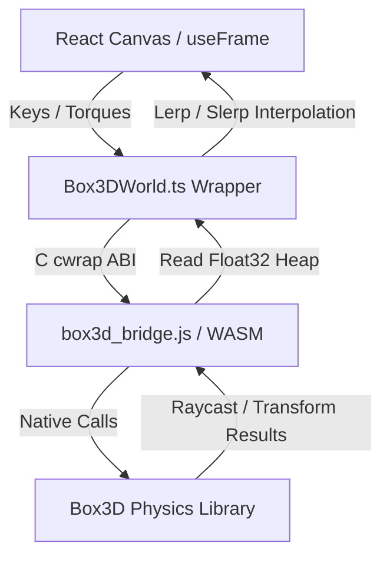

# 🤝 Handoff Documentation: Box3D Physics Beta

Welcome! This document outlines the architecture, data flows, compile workflow, and design decisions of the **Box3D WebAssembly Physics Beta** in the Marble Game.

---

## 🏗️ Architecture Overview

The Box3D beta runs alongside the standard Cannon physics system. It is selectable by adding the query parameter `?physics=box3d` to the address bar.



### 1. The C Bridge (`box3d_bridge.c`)
* **Opaque Pointer Pattern:** Box3D rigid bodies (`b3BodyId`) are wrapped in allocated structs (`MarbleBox3DBody`) on the C heap. JavaScript references them via opaque 32-bit pointers (`uintptr_t`).
* **Memory Management:** To avoid memory leaks, `b3HeightFieldData` allocations are tracked in a registry within the custom `MarbleBox3DBridgeWorld` struct. This guarantees that all native heightfield structures are automatically freed on world destruction.
* **Heap Copy Optimization:** Transforms, velocities, and raycast hit results are copied directly into pre-allocated memory slices in the WebAssembly heap buffer, avoiding serialization overhead.

### 2. TypeScript Adapter (`Box3DWorld.ts` & `box3dBridge.ts`)
* Manages WebAssembly heap allocation pointers (e.g. `transformPtr`, `velocityPtr`, `raycastPtr`).
* Implements type-safe wrappers for force/torque impulses, damping settings, resets, and raycasting queries.

### 3. Visual & Simulation Loop (Box3DScene.tsx)
* **WASM-Native Vision & Ground Queries:** Replaces Three.js raycasts with native `world.raycastClosest` queries.
  * *Vision:* Ray length matches displacement vector to player. Uses a dynamic fraction threshold check to verify clear line-of-sight without clipping player boundaries.
  * *Grounding:* Downward raycast fraction <= `(size+0.2) / (size+0.4)` evaluates if entity is grounded.
* **Pausing:** Toggles the loop execution using the store's `isPaused` state to completely freeze the physics simulation and visual interpolation hooks.
* **Unified Rules & Sonar Loop Ticking:** Houses a custom `Box3DGameLoopDriver` child component which advances the `GameLoop` and ticks the neutral `rulesSystem` and `sonarSystem` every frame.
* **Spatial Audio Listener:** Drives `soundManager.updateListener` and manages the audio graphs during setup, play, pause, and game-over transitions.
* **Interpolation:** Visual meshes are smoothed using `lerp` and `slerp` against physics transforms to prevent high-frequency frame jitter.

---

## 🛠️ Build & Compilation Workflow

### Requirements
* **Emscripten (emcc):** Installable via Scoop or EMSDK.
* **PowerShell:** Script execution permissions.

### Build Command
To compile the C source files into WebAssembly, run:
```powershell
powershell -ExecutionPolicy Bypass -File .\src\physics\box3d\native\build-box3d-bridge.ps1
```
This builds and places `box3d_bridge.js` and `box3d_bridge.wasm` in the `public/box3d` directory.

---

## 📐 Math & Grid Alignment Details
* **Terrain Winding:** Box3D heightfields are row-major (`z * countX + x`). This matches Three's visual terrain arrays.
* **Centering Offset:** Because Box3D grids start at `(0,0)`, the body transform must be offset by `[-((WIDTH - 1) * SCALE) / 2, 0, -((DEPTH - 1) * SCALE) / 2]` (which translates to `[-63, 0, -63]`) to align the visual mesh and physical collision boundaries exactly.

---

## 🔮 Future Backlog / Wish List

1. **Gameplay Recorder & Replay:** (Added to `BOX3D_BETA_PLAN.md`) Track entities, export states, and replay with free camera angles.
2. **Modular Enemy Strategies:** Support flanking, ambushing, or patrol patterns.
3. **X-Ray / Player See-Through Stencil:** Make dynamic boxes transparent when blocking the camera-to-player line of sight.
