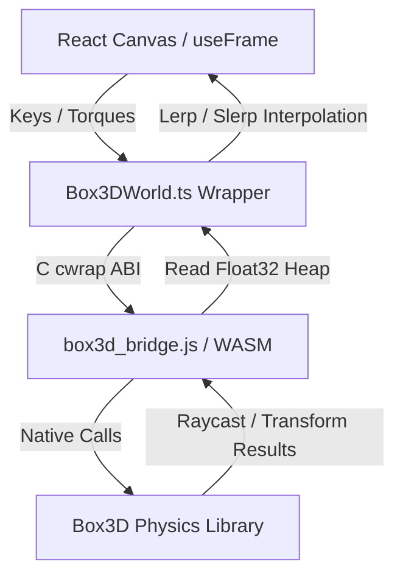

# 🤝 Handoff Documentation: Box3D Physics Beta

Welcome! This document outlines the architecture, data flows, compile workflow, and design decisions of the **Box3D WebAssembly Physics Beta** in the Marble Game.

> **Read `docs/STATUS.md` first** — it holds the live phase/priority stack, verification gates, and session log. This file is the durable architecture reference; STATUS is the moving state.
>
> **Session 15 (2026-07-09) — control panel + polish (built in a fresh cloud clone of `origin/v2@dc083ee`):** (1) **Right-hand SettingsMenu rewired (Known #6 closed).** It was wired almost entirely to legacy Cannon store keys the Box3D sim never reads (so the whole panel "felt dead"); now every control maps to a real Box3D knob — velocity movement (`moveTopSpeed`/`moveAccel`/`moveBrakeDecel`/`moveAirControl`/`jumpHeight`/`playerDrift`/`downhillRoll`), enemy drive (`enemySpeed`/`enemyVelUnit`/`enemyVelAccel`/`enemyAirControl`/`enemySize`/`enemyMass`), **Physics-Feel** gravity preset, **Play-Feel** preset, Environment (cubes+columns), **camera** (`cameraStiffness`/`cameraOffset`, now live — were hardcoded 6/11), **ground look** (now live — was a hardcoded texture), **occlusion mode**, and **Shadows**. Dead legacy sliders removed. (2) **Camera + ground defaults re-anchored + a v3→v4 settings migration** resets stale Cannon-era persisted values so wiring them live is look/feel-neutral. (3) **Environment + enemy size/weight rebuild live** (`Box3DScene` boot dep array now includes the arena keys; a stable per-session `seedRef` keeps the scatter layout coherent across rebuilds) — fixes "I restart and it doesn't change" (restart never remounted the scene). (4) **Obstacles orient to the terrain normal** (`utils/terrain.ts` `getTerrainNormal` → `MarbleSim.cubeQuaternions`/`columnQuaternions`, composed into instance matrices) — visual tilt only, colliders stay AA. (5) **See-through modes** (`occlusionMode`: ghost/wireframe/xray/silhouette/off — `CubeOcclusion.tsx`). (6) **Leaderboard top-100** (cap 10→100) + game-over **zoom-to-your-rank** window (`computePlacingWindow`). (7) **Columns render as real cylinders** (`<cylinderGeometry>`, radius `columnSize/2`) instead of squished cube boxes — visual only; the collider stays a square box (no cylinder bridge primitive → backlog #6). Verified `tsc` clean, vitest 77/77 ×5, build clean (2.475MB). See the new sections below.
>
> **Current feel state (2026-07-09, session 9):** player + enemy both **velocity-driven**. Feel: coast **drift/inertia**, **downhill roll** (analytic terrain gradient), **height-based jump** (default 1.8u), baseline **blend (C)** — all live sliders. Session 8 added three render/UX systems: **see-through cubes** (camera occlusion), a **particle FX structure** (roll trails + impact/landing bursts), and **play-feel presets** (5 one-click flavours). Session 9 added: **pause/gameover render-freeze** (`Canvas frameloop='demand'` when frozen — GPU stops redrawing), **countdown early-release** (`SimParams.freezeEnemy` pins the enemy at spawn so the first control-key press gives the player a head start), and **particle polish** — a red **enemy roll trail** + a fading ember **ground breadcrumb** on its own pooled system (sim now exposes `enemyVel`/`enemyGrounded`). Legacy torque/force paths remain behind DEV toggles. **Sessions 8+9 committed as `d74fc94`; Grayson gave a light "I think it worked" — detailed per-feature verdicts still welcome.** See "Render & FX systems" below for the particle architecture.
>
> **Session 10 (2026-07-09):** shipped the **Known #7** native-body-leak fix — `marble_box3d_body_destroy` now calls `b3DestroyBody(body->bodyId)` before freeing its JS wrapper (previously it freed *only* the wrapper, so the smoke-test dynamic sphere from `Box3DWorld.reset()` lingered in the native world at origin ≈ y4.35). WASM rebuilt on host + playtest-confirmed. C-only change; JS/TS destroy paths audited for double-free (none).
>
> **Session 14 (2026-07-09):** **Obst-2 columns (tall static pillars).** The sim already scattered, collided, and seed-tested columns (`MarbleSim.columnPositions`); this session wired the last mile so they actually appear and are tunable. New store keys `columnCount/columnSize/columnHeight` (`state/types.ts` + `DEFAULT_SETTINGS` 6/3/12 in `persistence.ts`); `Box3DScene.boot()` passes them into the sim's `obstacles` config (was hardcoded `0`); `MarbleSim` now exposes readonly **authoritative** `columnSize`/`columnHeight` (render must read these, not the live store — same anti-drift rule as `cubeScale`). A second `<instancedMesh>` in `Box3DPlayableScene` renders the pillars (`boxGeometry [size, height, size]`, lavender `#b8b0c8` over the shared cube grid texture, matrices set once per sim like the cubes). Player-facing sliders live in **SettingsMenu → 🌳 Environment** (Column Count/Size/Height) — apply on restart, same as the cube sliders (Known #5). **Columns are intentionally NOT camera-occluded:** `systems/render/occlusion.ts` `findOccludingCubes(cam, player, centers, half)` takes a single uniform `half`, correct for cubes but wrong for a tall pillar (non-uniform AABB); occluding columns needs a per-axis-extent variant — deferred to backlog. Verified: `tsc` clean, vitest 71/71 ×5, build clean (2.47MB).
>
> **Session 13 (2026-07-09):** **game-over "your placing" row.** The end screen's top-5 leaderboard (`components/ui/MenuOverlay.tsx` `GameOverScreen`) now appends a `⋯` divider + a gold-highlighted `#N (You)` row when the current run ranks 6th or lower, so the player can see where they placed vs the leaders without being in the top 5. A run below the tracked top 10 shows `#11+` with the live score (records cap at 10, so exact place beyond that isn't stored). The placing decision is a **pure, React-free helper** — `components/ui/records.ts` `computeYourPlacing(records, score, visibleCount, todayLabel)` — unit-tested in `records.test.ts` (5 cases); `MenuOverlay` just renders what it returns, reusing the existing current-run highlight style. If deeper true ranks are ever wanted, raise the `personalRecords` cap in `saveRecord` (`state/settingsSlice.ts`, currently `.slice(0, 10)`).
>
> **Session 12 (2026-07-09):** **retired the legacy movement models** — the player torque path (`applyTorqueControl`) and the enemy force-steering path are gone, along with the `movementModel`/`enemyMovementModel` store keys + DEV dropdowns + `MovementModel`/`EnemyMovementModel` types and the now-dead tuning constants. Velocity is the sole model. Zero feel change (velocity path untouched); build ~3KB lighter. The physics presets were trimmed to the three that carry real gravity variety (`current`/`v1Gravity`/`blend`, used by the Play-Feel presets); the dead `frictionOnly` A/B preset was removed (no-op duplicate of `current` under velocity — friction is bypassed grounded). DEV "Physics Feel" dropdown relabeled Light/Heavy/Blend.
>
> **Session 11 (2026-07-09):** the velocity-drive feel knobs are now **live-tunable from the settings store** (Known #6 core). Player `moveTopSpeed` / `moveAccel` / `moveBrakeDecel` / `moveAirControl` and enemy `enemyVelUnit` / `enemyVelAccel` are new store keys threaded through `SimParams` into `applyVelocityControl` / `applyEnemyVelocityControl`, exposed as a DEV TOOLS "Movement Tuning" slider group (+ an `enemySpeed` slider). Additive and safe: defaults are sourced from `tuning.ts` (`MOVEMENT.*` / `ENEMY.*`) so they can't drift, and the sim reads `params.X ?? CONST` so any caller omitting them (all prior tests) behaves byte-identically. Verified `tsc` clean, vitest 65/65 ×5, build clean.

---

## 🏗️ Architecture Overview

The Box3D beta runs alongside the standard Cannon physics system. It is selectable by adding the query parameter `?physics=box3d` to the address bar.



### 1. The C Bridge (`box3d_bridge.c`)
* **Opaque Pointer Pattern:** Box3D rigid bodies (`b3BodyId`) are wrapped in allocated structs (`MarbleBox3DBody`) on the C heap. JavaScript references them via opaque 32-bit pointers (`uintptr_t`).
* **Memory Management:** To avoid memory leaks, `b3HeightFieldData` allocations are tracked in a registry within the custom `MarbleBox3DBridgeWorld` struct. This guarantees that all native heightfield structures are automatically freed on world destruction.
* **Body lifecycle (session 10):** `marble_box3d_body_destroy` destroys the native Box3D body via `b3DestroyBody(body->bodyId)` (guarded by `b3Body_IsValid`) *before* freeing the JS wrapper struct. Prior to session 10 it freed only the wrapper, leaking the native body into the world — the cause of the origin smoke-sphere persisting (Known #7). Callers (`Box3DWorld.clearBodies` / `destroyWorldOnly`) destroy each pointer once then clear their list, so there is no double-free with world/heightfield teardown.
* **Heap Copy Optimization:** Transforms, velocities, and raycast hit results are copied directly into pre-allocated memory slices in the WebAssembly heap buffer, avoiding serialization overhead.

### 2. TypeScript Adapter (`Box3DWorld.ts` & `box3dBridge.ts`)
* Manages WebAssembly heap allocation pointers (e.g. `transformPtr`, `velocityPtr`, `raycastPtr`).
* Implements type-safe wrappers for force/torque impulses, damping settings, resets, and raycasting queries.

### 3. Visual & Simulation Loop (Box3DScene.tsx)
* **WASM-Native Vision & Ground Queries:** Replaces Three.js raycasts with native `world.raycastClosest` queries.
  * *Vision:* Ray length matches displacement vector to player. Uses a dynamic fraction threshold check to verify clear line-of-sight without clipping player boundaries.
  * *Grounding:* Downward raycast fraction <= `(size+0.2) / (size+0.4)` evaluates if entity is grounded.
* **Pausing:** Toggles the loop execution using the store's `isPaused` state to completely freeze the physics simulation and visual interpolation hooks.
* **Unified Rules & Sonar Loop Ticking:** Houses a custom `Box3DGameLoopDriver` child component which advances the `GameLoop` and ticks the neutral `rulesSystem` and `sonarSystem` every frame.
* **Spatial Audio Listener:** Drives `soundManager.updateListener` and manages the audio graphs during setup, play, pause, and game-over transitions.
* **Interpolation:** Visual meshes are smoothed using `lerp` and `slerp` against physics transforms to prevent high-frequency frame jitter.

> Note: since the session-3 headless refactor, gameplay logic (input, AI, tag, resets) lives in **`systems/sim/MarbleSim.ts`**, not inline in `Box3DScene.tsx`. The scene is render + glue only. Treat `MarbleSim` as the authority for anything below.

### 4. Movement Model (`systems/sim/MarbleSim.ts` + `tuning.ts`)
**Velocity-driven is the sole model** (the legacy torque/force alternatives were retired session 12 after velocity won the Known-#4 A/B). `applyVelocityControl` drives the player's *horizontal velocity* directly toward `inputDir · MOVEMENT.topSpeed` (accelerate at `MOVEMENT.accel`, brake at `MOVEMENT.brakeDecel`), and slaves spin to motion — rolling-without-slip about the up normal gives `ω = (v_z/r, 0, -v_x/r)`. Vertical velocity (gravity/jump) is left to physics; airborne hands back to physics apart from a light `airControl` nudge. Result: 1:1 ball-on-ground feel, no wheel-spin.

Feel is tuned via the `MOVEMENT` block in `tuning.ts` — and, as of session 11, the core knobs (`topSpeed`/`accel`/`brakeDecel`/`airControl`) are **live-overridable per step** via `SimParams.moveTopSpeed`/`moveAccel`/`moveBrakeDecel`/`moveAirControl` (store keys, DEV "Movement Tuning" sliders). The sim reads `params.X ?? MOVEMENT.X`, so the `tuning.ts` values remain the defaults. Coast internals (`coastDrag*`, `coastFloor`, `downhillMaxSpeed`) stay constants. Input mapping: forward = `-Z`, right = `+X`. The velocity model overrides grounded traction directly, so `PLAYER.friction` and the physics-preset **friction** lever are now largely vestigial (they only affect collisions/airborne contact); **gravity** and **jump height** are the levers that still matter.

**Velocity-model feel (all live via `SimParams`, no rebuild):**
* **Enemy velocity drive** — `applyEnemyVelocityControl` mirrors the player: velocity toward the AI heading (with avoidance) at `enemySpeed · getSpeedMultiplier(state) · ENEMY.velUnit`, spin slaved `ω = v/r`. (The enemy is pinned at spawn instead when `SimParams.freezeEnemy` is set — countdown early-release.) Chase ≈ 19.5 u/s at default `enemySpeed 2` — tune live with the `enemyVelUnit` / `enemyVelAccel` / `enemySpeed` sliders (session 11; `params.enemyVelUnit ?? ENEMY.velUnit`, etc.).
* **Coast drift / inertia** — on release (grounded, no input) velocity decays by exponential drag (`MOVEMENT.coastDragMax→Min`, picked by the `playerDrift` 0..1 slider) plus a small `coastFloor` so it settles on flat. Long, floaty glide at high drift.
* **Downhill roll** — while coasting on a slope, accelerate downhill by `|g|·sinθ · downhillRoll`. **θ comes from the analytic `getTerrainHeight` gradient, NOT the raycast normal** (the WASM heightfield raycast returns a flat up-normal — verified). Consequence: rolls on terrain, not on cube tops. `downhillRoll` 0..1 slider.
* **Height-based jump** — vertical velocity set directly to `sqrt(2·|g|·jumpHeight)` (mass-free, exact, height constant across gravity presets). `jumpHeight` slider, default `PLAYER.jumpHeight = 1.8`. `PLAYER.jumpImpulse`/preset `jumpImpulse` are now vestigial (kept only for the PhysicsFeel preset contract + its parity test).

---

## 🎨 Render & FX systems (session 8)

These are **render-layer** systems — they read sim state / listen to cosmetic sim events but never feed back into `MarbleSim`, so determinism (F8/F9) is untouched.

### See-through cubes (camera occlusion)
`systems/render/occlusion.ts` is pure geometry: `segmentIntersectsCube` (slab method, clamped to the segment's [0,1]) and `findOccludingCubes(cam, player, centers, half)` → cube indices the camera→player sightline passes through, nearest-first, capped, with the segment shortened near the player so a cube it rests against doesn't strobe. No raycaster, no BVH — it runs against the sim's authoritative `cubePositions`, so it's unit-tested headlessly. `components/game-beta/CubeOcclusion.tsx` calls it ~20 Hz: hides blocking InstancedMesh instances (zero-scale matrix), restores others (composing the cube's terrain-tilt quaternion so the restore matches the tilted solid instance), and renders a **reveal** in their place. It's fed the interpolated player render position via `playerRenderPosRef` from `Box3DPlayableScene`.

**Reveal modes (session 15 — `occlusionMode` store key, Settings → Visuals):** `ghost` (original ~40% transparent textured + faint edges), `wireframe` (edges-only bounding box, fully see-through), `xray` (back-faces only — the near face is culled so you see through into the far interior wall, reading the cube's depth + where you're colliding), `silhouette` (dark tinted see-through fill + bright edges), `off` (no occlusion). The mode also drives whether the solid instance is hidden; a mode-change effect restores every hidden instance so nothing is left invisible. Ghost meshes inherit each cube's tilt quaternion. Occlusion is still **cubes only** — columns stay solid (the session-14 column-occlusion backlog item can now reuse these modes once a non-uniform-AABB `findOccludingCubes` variant exists).

### Particle FX (extensible structure)
`systems/fx/ParticleSystem.ts` is a **pooled, single-draw-call** system (render-side, framework-agnostic): SoA `Float32Array`s, swap-remove on death, one additive `THREE.Points`. Particles fade by scaling colour → 0. Per-particle gravity (trails float, impacts fall). API: `emit()` (one), `emitBurst()` (radial), `emitTrail()` (one behind the ball), `update(dt)`, `clear()`. **To add a new effect, add an `emit*` call — no new draw call.**

`components/game-beta/Box3DParticles.tsx` owns one system and drives three emitters:
- **roll trails** — each frame while `sim.playerGrounded` and horizontal speed > `FX.trailMinSpeed`, at a rate that scales with speed;
- **impact bursts** — on the sim's `onImpact` event;
- **landing bursts** — on the sim's `onLand` event.

The sim→particles channel is a `WeakMap<MarbleSim, handler>` (`dispatchFx`), set on mount and called by the sim-event callbacks wired in `Box3DScene.boot()` — same pattern as the AI-state listener.

**Sim cosmetic events** (`SimEvents`, all optional, render-only): `onImpact(x,y,z,strength)` fires when horizontal speed drops > `FX.impactSpeedDrop` in one step (wall/cube hit — the velocity model can't drop that fast on its own, so it's unambiguous); `onLand(x,y,z,impactSpeed)` fires on an airborne→grounded transition when the prior downward speed exceeded `FX.landSpeed`. Fall-resets zero the trackers to avoid false positives. Thresholds live in `tuning.ts` `FX`.

### Play-feel presets
`tuning.ts` `PLAYFEEL_PRESETS` (Classic / Ice Rink / Arcade / Heavyweight / Predator) bundle `physicsPreset + playerDrift + downhillRoll + jumpHeight + enemySpeed`. `applyPlayfeelPreset(name)` writes those store values and sets `playfeelPreset`; nudging any of `PLAYFEEL_KEYS` afterward flips it to `custom` (same pattern as `graphicsPreset`). `classic` mirrors `DEFAULT_SETTINGS` (guarded by a test). DEV TOOLS "Play-Feel" dropdown. Note: a preset can change `physicsPreset`, which rebuilds the arena (resets the round).

---

## 🛠️ Build & Compilation Workflow

### Requirements
* **Emscripten (emcc):** Installable via Scoop or EMSDK.
* **PowerShell:** Script execution permissions.

### Build Command
To compile the C source files into WebAssembly, run:
```powershell
powershell -ExecutionPolicy Bypass -File .\src\physics\box3d\native\build-box3d-bridge.ps1
```
This builds and places `box3d_bridge.js` and `box3d_bridge.wasm` in the `public/box3d` directory.

---

## 📐 Math & Grid Alignment Details
* **Terrain Winding:** Box3D heightfields are row-major (`z * countX + x`). This matches Three's visual terrain arrays.
* **Centering Offset:** Because Box3D grids start at `(0,0)`, the body transform must be offset by `[-((WIDTH - 1) * SCALE) / 2, 0, -((DEPTH - 1) * SCALE) / 2]` (which translates to `[-63, 0, -63]`) to align the visual mesh and physical collision boundaries exactly.

---

## 🔮 Future Backlog / Wish List

1. **Gameplay Recorder & Replay:** (Added to `BOX3D_BETA_PLAN.md`) Track entities, export states, and replay with free camera angles.
2. **Modular Enemy Strategies:** Support flanking, ambushing, or patrol patterns.
3. ✅ **See-through cubes / camera occlusion — DONE (session 8).** See "Render & FX systems" above (`systems/render/occlusion.ts` + `CubeOcclusion.tsx`). The old Cannon-path `components/game/CameraOcclusion.tsx` is now superseded for Box3D.
4. **FX polish (session-8 backlog):** per-particle **size** (needs a small `ShaderMaterial` — `PointsMaterial` is one fixed size for all particles); a **trail on the enemy** too; a **jump-launch puff** (fire an `onJump` cosmetic event); tune `FX` thresholds + colours to taste.
5. **Column camera occlusion (session-14 backlog):** columns (Obst-2) are solid — a tall pillar between camera and player blocks the view, unlike cubes which now reveal (sessions 8 + 15). `systems/render/occlusion.ts` assumes a uniform cube `half`; supporting columns needs a non-uniform-AABB variant of `findOccludingCubes` (per-axis half extents) + a column render that reuses the session-15 reveal modes in `CubeOcclusion.tsx` (or a sibling). Only worth building if Grayson's playtest says the pillars are visually obtrusive.
6. **Round + rotated obstacle colliders (session-15 backlog):** obstacles now (a) tilt to the terrain normal and (b) render columns as **cylinders** — both *visual* only. The physics `createStaticBox` colliders stay axis-aligned square boxes (the bridge has neither a rotation arg nor a cylinder primitive). A true tilted/round collider needs new `marble_box3d_create_*` bridge functions (quaternion + a cylinder primitive) + a WASM recompile (same class of change as the Known #7 fix). Gentle slopes + thin columns keep the mismatch minor (a cylinder's square collider overhangs ~0.62u at the 4 diagonals on a default size-3 pillar); only worth building if collisions feel off in playtest.
7. **Debounce the live arena rebuild (session-15 backlog):** Environment/enemy sliders now rebuild the WASM world on every change (live feedback). If dragging stutters, debounce the rebuild (rebuild ~250ms after the last change) instead of per-tick.
